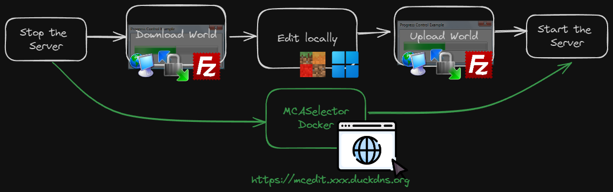

# Docker container for MCASelector
[](https://github.com/vttc08/docker-mcaselector/releases/latest)
[](https://hub.docker.com/r/vttc08/mcaselector/tags)
[](https://hub.docker.com/r/vttc08/mcaselector)
[](https://hub.docker.com/r/vttc08/mcaselector)
[](https://github.com/vttc08/docker-mcaselector/actions/workflows/build-image.yml)
[](https://paypal.me/JocelynLeSage)

This project implements a Docker container for [MCASelector](http://github.com/Querz/mcaselector).

I used the jlesage [jlesage/docker-baseimage-gui](https://github.com/jlesage/docker-baseimage-gui) with Ubuntu 22.04 as the base image to build this container (alpine do not work due to MCASelector requiring JavaFX). 

The project allows Minecraft admins to modify chunks with a powerful GUI tool directly in browser without having to copy and paste the world save to a local machine. This could be useful for editing worlds on a VPS/headless server, editing a world with slow non-local network/VPN connections or allowing multiple admins to edit the world without constantly transferring the world save.



---

[](https://github.com/Querz/mcaselector/releases) [](https://www.paypal.com/cgi-bin/webscr?cmd=_s-xclick&hosted_button_id=3PV2GDWZL8HCA) [](https://discord.gg/h942U8U)


#### An external tool to export or delete selected chunks and regions from a world save of Minecraft Java Edition.

---
## Limitations


**Fullscreen do not work** - this is documented in [here](https://github.com/vttc08/docker-mcaselector/issues/1)
- To enable fullscreen, you'll need to manually click the maximize icon on the top right of the window every time you start/restart the container
- The windows size in Openbox for this software is inconsistent, to change the size of a window in Openbox: 
  - Hold down the Alt key and right-click on the window to the direction you want to resize it.

If you know the cause or how to fix this, feel free to make a pull request.


## Table of Content

- [Docker Run Command](#docker-run-command)
- [Docker-Compose](#docker-compose)
- [Updates](#updates)
  - [Container](#container)
  - [Application](#application)
- [Additional Information](#additional-information)
  - [MCASelector](#mcaselector)
  - [Docker Image Configuration](#docker-image-configuration)
- [Development](#development)
  - [Reproduce the Fullscreen Bug](#reproduce-the-fullscreen-bug)

## Docker Run Command

**NOTE**:
    The Docker command provided in this quick start is given as an example
    and parameters should be adjusted to your need.

Launch the MCASelector docker container with the following command:
```shell
docker run -d \
    --name=mcaselector \
    -p 5800:5800 \
    -v /docker/minecraft-server/world:/world:rw \
    -v /appdata/mcaselector:/config:rw \
    vttc08/mcaselector
```

Where:

  - `/appdata/mcaselector`: This is where the application stores its configuration, states, log and any files needing persistency.
  - `/docker/minecraft-server/world`: This is where the world save of Minecraft Java Edition which you want to edit in MCASelector.

  **⚠ MCA Selector modifies and deletes chunks in your Minecraft world. Please make backups of your world before using.**
  - If you do not wish to edit the chunks and save it directly to your server, you should mount your backup world instead and copy that once the edit is successful.


Browse to `http://your-host-ip:5800` to access the MCASelector GUI.

## Docker-Compose

```yaml
version: '3'
services:
  mcaselector:
    image: vttc08/mcaselector
    container_name: mcaselector
    ports:
      - "5800:5800"
      - "5900:5900"
    volumes:
      - "/docker/minecraft-server/world:/world:rw"
      - "/appdata/mcaselector:/config:rw"
    environment:
      - USER_ID=1000
      - GROUP_ID=1000
      - TZ=America/New_York
      - KEEP_APP_RUNNING=1
      - MEMORY=4G
    restart: unless-stopped
```

| Parameter | Description |
|-----------|-------------|
| port 5800        | The noVNC port to access the GUI in a web browser |
| port 5900        | The VNC port that is used to access the GUI with a VNC client |
| volumes | Check [Docker Run Command](#docker-run-command) for more information |
| USER_ID/GROUP_ID        |  The user/group ID that should run the application.  See [User/Group IDs](https://github.com/jlesage/docker-baseimage-gui?tab=readme-ov-file#usergroup-ids) for more information. |
| TZ        | Time zone, check [here](https://en.wikipedia.org/wiki/List_of_tz_database_time_zones) for supported timezone variables |
| KEEP_APP_RUNNING        | By default is not enabled. Set to 1 so the container will restart the app if it crash or exits. Could be useful if you want to force restart the app by quitting it in the GUI. |
| Memory        | The amount of memory to allocate to the container eg. `4G`, `4096M`. Default is 4G which is recommended by [MCASelector wiki](https://github.com/Querz/mcaselector/wiki/Installation). If you're running on paid VPS hosting with limited RAM or sharing resource with Minecraft server, you can lower this. Any RAM assignment lower than 400MB the app will crash often. To avoid it with low RAM, you can take advantage that this app cannot fullscreen to adjust the window size smaller, avoid rapid movement and do not load large worlds. |

## Updates
### Container
To update the container, you can run the following commands which will pull the latest container image, then re-run the container with the same parameters as before:
```shell
docker pull vttc08/mcaselector
```
or using docker compose 
```shell
docker compose pull
docker compose up -d --force-recreate
```
### Application
This container image may not follow the latest release of MCASelector or you want to run a different version of MCASelector without building an entire container. To update:
- Download the latest release of MCASelector from [here](https://github.com/querez/mcaselector/releases) using `wget` or `curl` on your server.
  - if you use a bind mount, simply replace the jar file in `/config` with the new jar file
  - if you use a volume or other method, you can copy the jar file into the container
  ```shell
  docker cp mcaselector.jar mcaselector:/config
  ```

## Additional Information
### MCASelector
To documentation for MCASelector can be found [here](https://github.com/Querz/mcaselector/wiki).

There are also YouTube tutorials 

* [How To Reset Chunks In Your Minecraft World!](https://www.youtube.com/watch?v=1xx8fwynlRs) by [Farzy](https://www.youtube.com/channel/UCVtz3s3FUxVxBgPl2OWtIJQ)
* [How To Clear Unwanted Chunks In Minecraft 1.16 | MCASelector Tutorial](https://www.youtube.com/watch?v=ADDTXGRJo20) by [Muriako](https://www.youtube.com/channel/UCpt-MjKkc5X4W7bUFV3Dwrw)
* [Preparing Your World for the Nether Update! - The Minecraft Survival Guide](https://www.youtube.com/watch?v=1fiyVvoD9jQ) starting at [2:52](https://www.youtube.com/watch?v=1fiyVvoD9jQ&t=2m52s) by [Pixlriffs](https://www.youtube.com/channel/UCgGjBqZZtAjxfpGSba7d6ww)
* [How To Reset The End Dimension! - The Minecraft Survival Guide](https://www.youtube.com/watch?v=p-2gFkJl_Lo) starting at [8:45](https://www.youtube.com/watch?v=p-2gFkJl_Lo&t=8m45s) by [Pixlriffs](https://www.youtube.com/channel/UCgGjBqZZtAjxfpGSba7d6ww)

Not all features of MCASelector may work, if you encounter any issues and do not encounter it when running MCASelector natively, please open an issue [here](https://github.com/vttc08/docker-mcaselector/issues).

### Docker Image Configuration

The above [docker-compose](#docker-compose) file is a good starting point for configuring jlesage GUI containers. For advanced configuration such as changing the resolution, password authentication, ports and logging, consult the [base image documentation](https://github.com/jlesage/docker-baseimage-gui#environment-variables) for those options. 

## Development
If you want to contribute to this project, you can fork/clone this repository and make a pull request.
```shell
git clone https://github.com/vttc08/docker-mcaselector.git
cd docker-mcaselector
```
Build the image
```shell
docker build . -t mcaselector
```
If you want to publish the image via Github Action. Make sure to set the `DOCKER_USERNAME` and `DOCKER_TOKEN` in the repository secrets and change `DOCKER_IMAGE_NAME` in `.github/workflows/build-image.yml`.

### Reproduce the Fullscreen Bug
jlesage images uses `rootfs/etc/openbox/main-window-selection.xml` to make a window fullscreen. You can read official documentation on the full screen [here](https://github.com/jlesage/docker-baseimage-gui?tab=readme-ov-file#maximizing-only-the-main-window). Change the `main-window-selection.xml` to this to reproduce.
```xml
<Type>normal</Type>
<Name>net.querz.mcaselector.ui.Windows</Name>
```